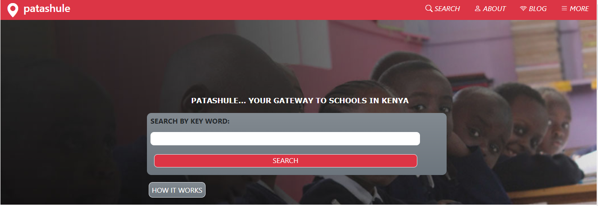
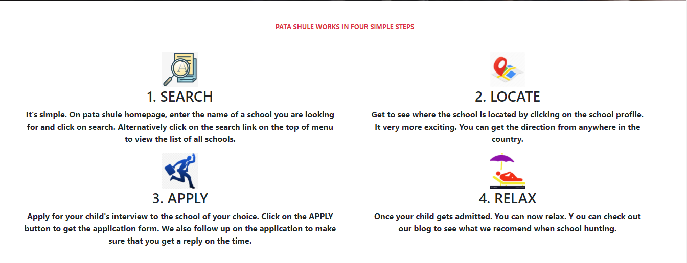
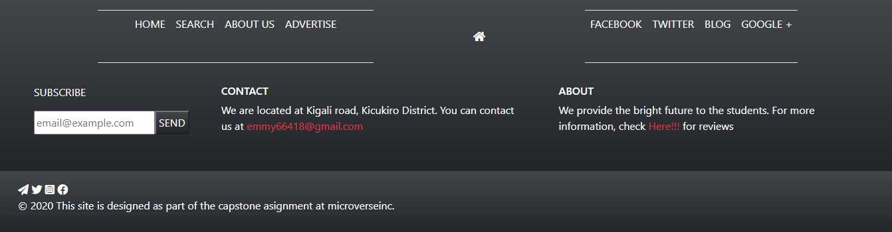
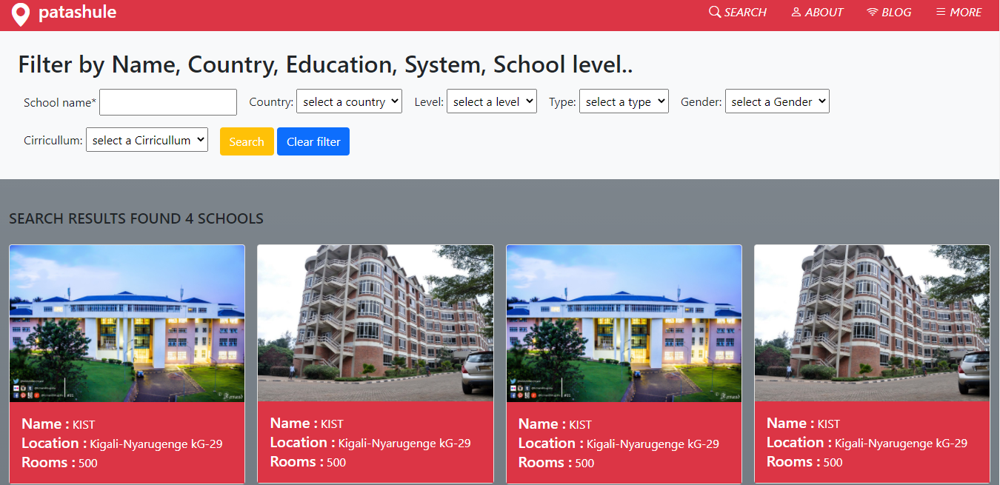
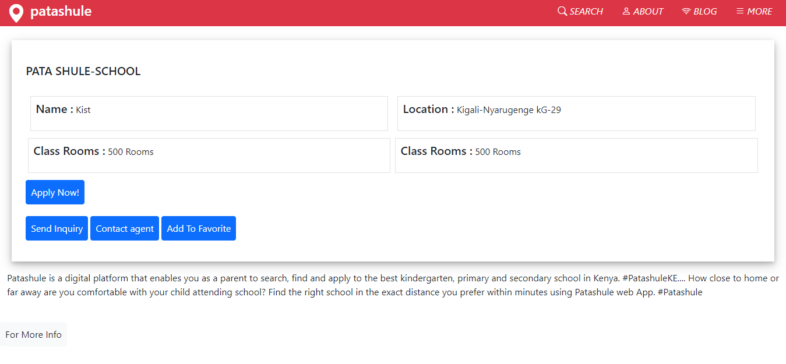

  
  
  
  

# `DirectoryOf-Schools`

###### Patashule is a web app that bridges the gap between schools and parents. We developed this as a result of a felt need by parents/ guardians and learners for adequate accurate and necessary information on their preferred schools and inability to apply online.

###### This a capstone project that help us to implement what we have learned or covered in the previous courses as well as to implement a client's project. 

 The goal of
> To achieve this, the project makes use of HTML5 and CSS3 and focuses on the web responsivity aspects of the project, making use of media queries to achieve this and bootstrap mainly.

Additional description about the project and its features.

## `Built With`

- HTML5 , CSS3, SASS
- Bootstrap
- Windows
- Font awesome icons

## `Live Demo`

[Live Demo Link](https://emmyn5600.github.io/DirectoryOf-School/)

## `Loom Video`

[Click Here](https://www.loom.com/share/ce01af4d87224102acfc76f265c54f6f)

## `Getting Started`

To get a local copy up and running follow these simple steps

 - git clone (https://github.com/Emmyn5600/DirectoryOf-School.git)
 - cd DirectoryOf-Schools/
 - git checkout development
 - git pull
 - If you have VScode Live Server installed, run it and open.

## `Author`

👤 **NSABIMANA Emmanuel**

- GitHub: [@emmyn5600](https://github.com/Emmyn5600)
- Twitter: [@NSABIMA62253884](https://twitter.com/NSABIMA62253884)
- LinkedIn: [@nsabimana-emmanuel-4276091b2](https://www.linkedin.com/in/nsabimana-emmanuel-4276091b2/)

## 🤝 Contributing

Contributions, issues, and feature requests are welcome!

Feel free to check the [issues page](https://github.com/Emmyn5600/DirectoryOf-School/issues).

## Show your support

Give a ⭐️ if you like this project!

## Acknowledgments

- Mathew Njuguna and others on Behance
- Microverse ( https://www.microverse.org/ )

## 📝 License

This project is [MIT](https://www.mit.edu/) licensed.
